# ✨ Sparka

**Enamórate de cómo piensa alguien.** Sparka es la app de citas donde importa lo que piensas, no solo tu foto, y donde nadie desaparece sin decir adiós. Y todas las funciones son gratis para todo el mundo.

## Solo en Sparka

### 🙈 A ciegas: la Pregunta del Día

Cada día hay **una pregunta nueva, la misma para todo el mundo** (“¿Qué superpoder completamente inútil te encantaría tener?”).

1. Respondes, y solo entonces puedes leer las respuestas de la gente cercana: **sin fotos, sin nombres**. Solo ves edad, distancia, qué busca y cuántos intereses compartís.
2. Das una **chispa ✨** a las respuestas que te enamoran. Es secreto.
3. Si a esa persona también le encanta la tuya: **match a ciegas**. Su foto se revela con una animación y la conversación empieza con vuestras dos respuestas.
4. Si no es mutuo, **nunca sabrá quién fuiste**. Solo verá que “a alguien” le encantó su respuesta.

Y una segunda oportunidad: en “A ciegas” **sí aparece gente a la que descartaste por su foto** en Descubrir.

### 💓 El Pulso: adiós al ghosting

Cuando una conversación lleva 48 h en silencio (o cuando alguien lo pide desde el chat), Sparka **pregunta en secreto a las dos personas**: “¿Te apetece seguir hablando?”.

- **Sí + sí** → “¡Pulso mutuo!” y os proponemos un plan concreto según vuestros intereses en común.
- **Un no** → la conversación se cierra con una **despedida amable** escrita por Sparka. Nadie tiene que buscar las palabras, y nadie se queda esperando.
- **Sin respuesta en 3 días** → se cierra sola.
- Tu “sí” **solo se revela si es mutuo**: nunca te expones.

### 📅 Coincidir: la cita, cuadrada en secreto

El paso que más cuesta en una app de citas es pasar del chat a quedar: el “¿y tú cuándo puedes?”, el miedo a un “no puedo”… y la conversación que se apaga. En Sparka:

1. Cualquiera de los dos pulsa **¿Cuándo coincidimos?** en el chat.
2. Cada persona marca **en secreto** sus huecos de los próximos 7 días (mañana, tarde o noche). Hay atajos como “todas las tardes” o “fin de semana”.
3. Sparka **solo revela las coincidencias**: el mejor momento, otras opciones y una idea de plan según vuestros intereses comunes, con un botón **Añadir al calendario** (`.ics`) y un recordatorio de seguridad.
4. Nadie ve nunca la agenda de la otra persona ni cuándo “no puede”. Si no coincidís, Sparka lo dice sin culpar a nadie.

<p align="center">
  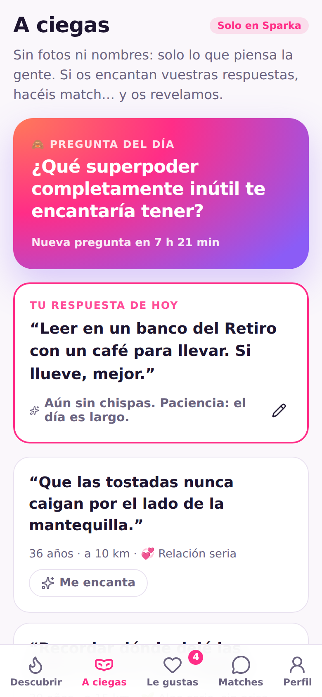
  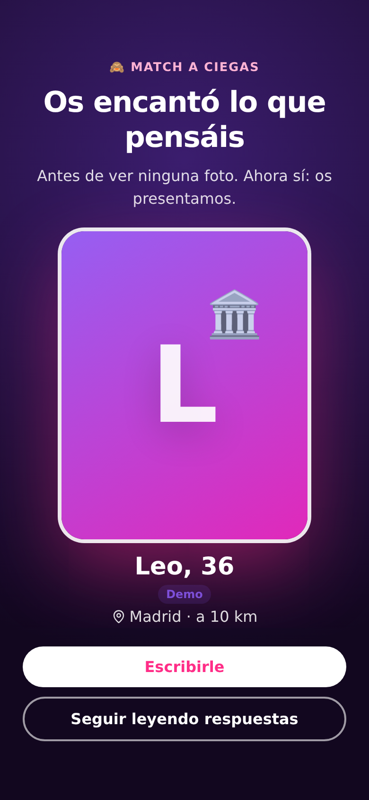
  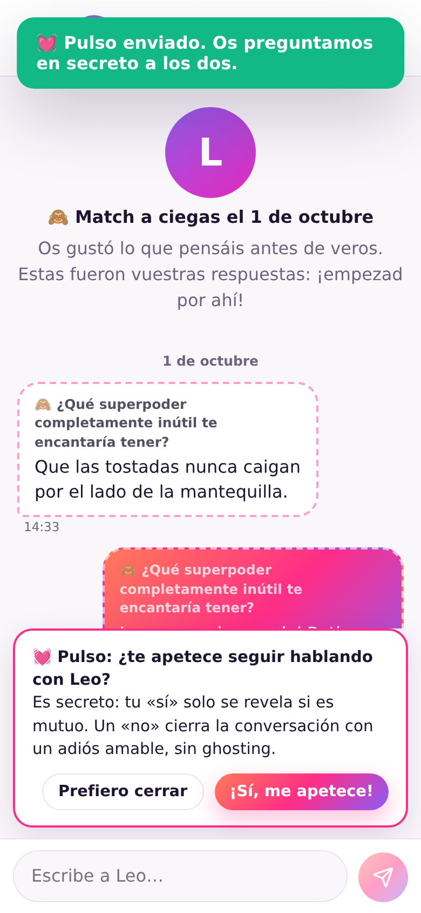
  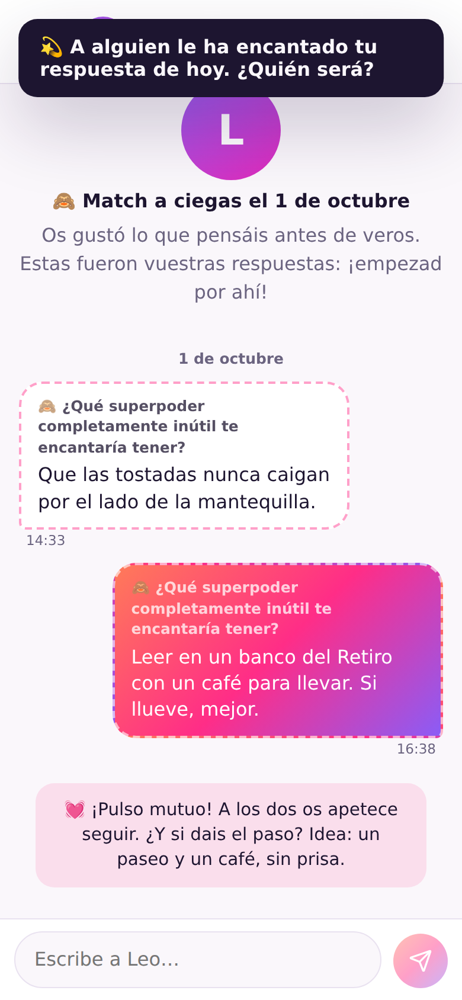
</p>
<p align="center">
  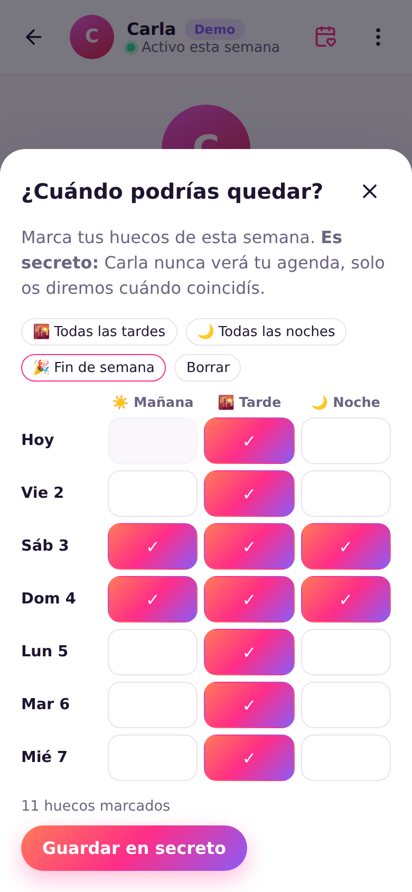
  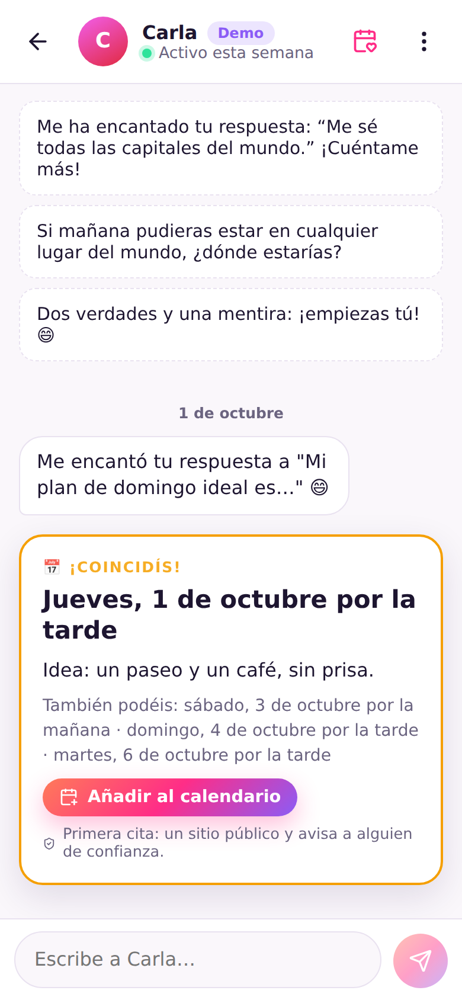
</p>

## Además: todo gratis

Sparka también hace lo que ya conoces (deslizar, hacer match y chatear), pero sin muros de pago:

<p align="center">
  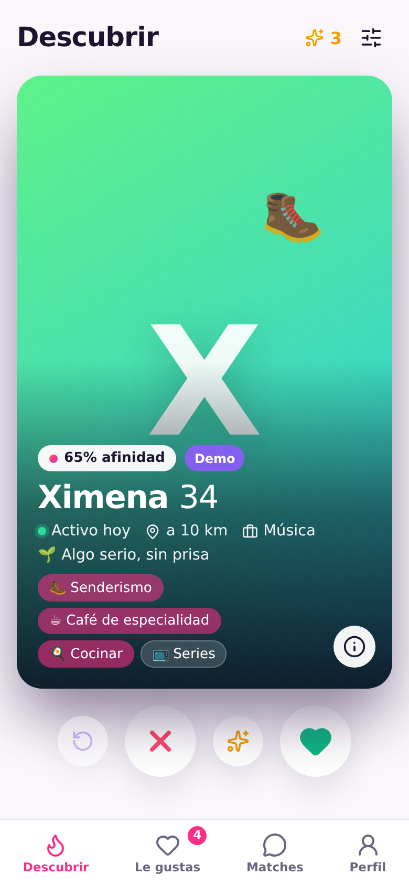
  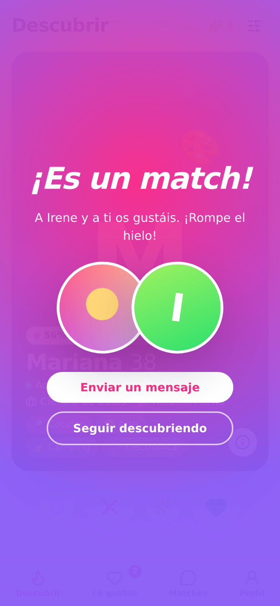
  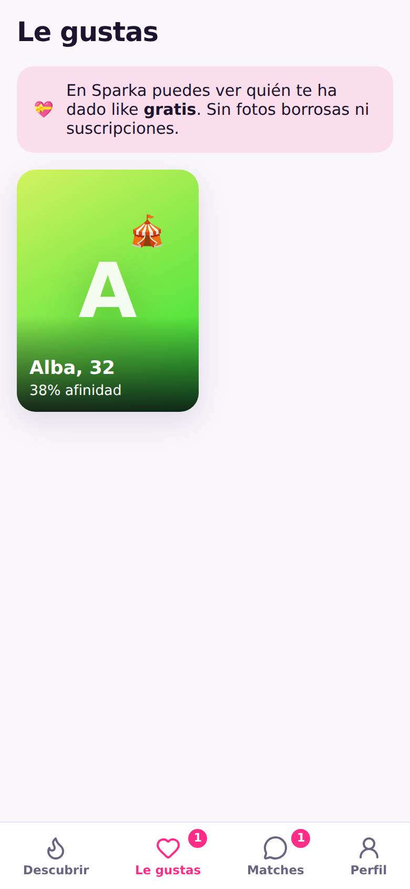
  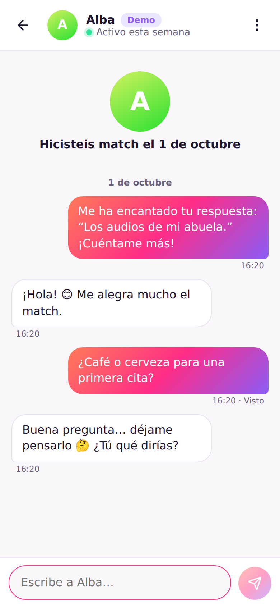
</p>

| | Apps de citas habituales | **Sparka** |
|---|---|---|
| Conocer gente por lo que piensa, sin ver fotos | No | ✅ **A ciegas**, cada día |
| Qué pasa cuando alguien deja de contestar | Ghosting | ✅ **El Pulso**: cierre amable o plan mutuo |
| Pasar del chat a la cita | “¿Y tú cuándo puedes?” | ✅ **Coincidir**: huecos secretos, solo se revela lo común |
| Ver quién te ha dado like | Normalmente de pago | ✅ Gratis |
| Likes | Limitados al día | ✅ Ilimitados |
| Deshacer el último swipe | Normalmente de pago | ✅ Gratis |
| Super likes | Muy pocos o de pago | ✅ 3 **Chispas** al día, con mensaje |
| Filtros (edad, distancia, intención) | Avanzados de pago | ✅ Todos gratis |
| Modo incógnito | De pago | ✅ Gratis |
| Por qué te enseña a alguien | Algoritmo opaco | ✅ % de afinidad **con explicación** |
| Perfil | Sobre todo fotos | ✅ Preguntas, intereses e intenciones claras |
| Seguridad | Variable | ✅ Avisos anti-estafa, filtro de insultos, bloqueo y denuncia |

## Funciones

- **Descubrir**: pila de tarjetas con gestos (arrastrar a la derecha = me gusta, izquierda = paso, arriba = Chispa), botones y atajos de teclado (`←` `→` `↑`).
- **Afinidad transparente**: cada perfil muestra un % calculado con intereses en común, intenciones compatibles, distancia y actividad, y te explica *por qué* (“Compartís: senderismo, café”).
- **Le gustas**: mira gratis quién te ha dado like (con su mensaje, si lo envió) y responde desde ahí.
- **Likes con mensaje**: comenta una respuesta concreta del perfil o envía una **Chispa ✨** con un mensaje. Al hacer match, el mensaje abre la conversación.
- **Chat en tiempo real** (Socket.IO): “escribiendo…”, confirmación de lectura (“Visto”), ideas para romper el hielo basadas en lo que tenéis en común.
- **Seguridad**:
  - Si vas a enviar un insulto, Sparka te pide confirmación (“¿Seguro que quieres enviar esto?”).
  - Los mensajes que piden dinero, Bizum, PayPal, cripto, códigos… muestran un **aviso anti-estafa** a quien los recibe.
  - Bloquear y denunciar en un toque (denunciar también bloquea). La otra persona no recibe ningún aviso.
  - Deshacer match: la conversación desaparece para ambas personas.
- **Privacidad**: nunca se expone email, fecha de nacimiento ni ubicación exacta (la distancia se redondea). Modo incógnito: solo te ve quien tú hayas elegido.
- **Perfiles completos**: hasta 6 fotos, hasta 3 preguntas con respuesta, 3–10 intereses, intención (relación seria, algo casual, amistad…).
- **Solo +18**: la fecha de nacimiento se valida en el servidor.
- Diseño móvil primero, modo oscuro automático, accesible con teclado y lector de pantalla.

<p align="center">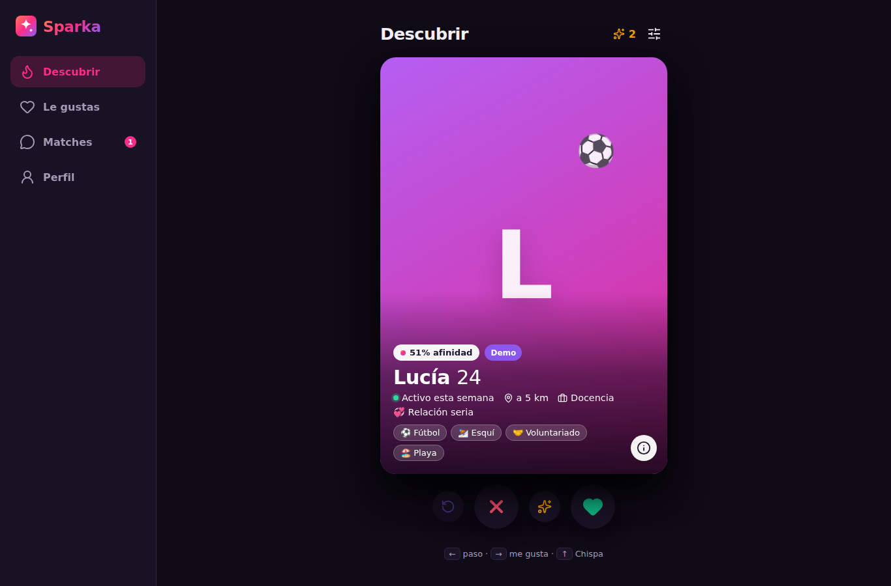</p>

## Empezar

Requisitos: **Node.js 22.13 o superior** (usa el SQLite integrado de Node, no hace falta instalar ninguna base de datos).

```bash
npm install
npm run dev
```

Abre **http://localhost:5173**, crea una cuenta y completa tu perfil.

> **Modo demo:** la primera vez se crean ~540 perfiles de ejemplo repartidos por 20 ciudades de España y Latinoamérica para que puedas probarlo todo: algunos ya te habrán dado like, devuelven likes, contestan en el chat, responden a la Pregunta del Día, dan chispas a tu respuesta, votan en el Pulso y marcan sus huecos en Coincidir. Están **siempre marcados como “Demo”** y no pueden iniciar sesión. Desactívalo en producción con `DEMO_MODE=false`.

### Producción

```bash
npm run build     # compila la web en client/dist
npm start         # sirve web + API + tiempo real en http://localhost:3001
```

O con Docker:

```bash
docker build -t sparka .
docker run -p 3001:3001 -v sparka-data:/data -e DEMO_MODE=false sparka
```

Si lo despliegas detrás de un proxy con HTTPS (Render, Fly.io, Railway, Nginx…), pon `TRUST_PROXY=true` para que las cookies de sesión sean `Secure`.

### Configuración

| Variable | Por defecto | Descripción |
|---|---|---|
| `PORT` | `3001` | Puerto del servidor |
| `DB_FILE` | `./data/sparka.db` | Archivo de la base de datos SQLite |
| `UPLOAD_DIR` | `./data/uploads` | Carpeta de las fotos subidas |
| `DEMO_MODE` | `true` | Crea y anima perfiles de ejemplo (marcados como “Demo”) |
| `TRUST_PROXY` | `false` | Actívalo detrás de un proxy HTTPS |

Otros comandos: `npm test` (tests de API, tiempo real y lógica de matching) y `npm run seed` (regenera los perfiles demo).

## Cómo está hecho

```
server/            API (Express 5) + tiempo real (Socket.IO) + SQLite (node:sqlite)
  app.js           Montaje de la app, cabeceras de seguridad, errores
  auth.js          Contraseñas (scrypt), sesiones en cookie httpOnly, rate limiting
  matching.js      Edad, distancia, elegibilidad mutua y cálculo de afinidad
  safety.js        Detección de insultos y de posibles estafas
  blind.js         "A ciegas": pregunta del día, feed anónimo y match a ciegas
  blindQuestions.js  Las preguntas (y respuestas de ejemplo para el modo demo)
  pulse.js         El Pulso: votos secretos, cierre amable y caducidad
  coincide.js      Coincidir: huecos secretos y plan con lo que tenéis en común
  matchmaker.js    Crear matches y publicar mensajes (lo usan swipes, A ciegas y Pulso)
  demo.js          Perfiles demo y su comportamiento
  routes/          auth · me (perfil, fotos, preferencias) · discover (swipes, likes) · matches (chat) · safety
client/src/        Web (React 19 + Vite)
  pages/           Landing, Onboarding, Discover, Likes, Matches, Chat, Profile
  components/      Tarjeta deslizable, detalle de perfil, formularios, diálogos
tests/             node:test + supertest + socket.io-client
```

### Seguridad implementada

- Contraseñas con **scrypt** y sal aleatoria; comparación en tiempo constante (también cuando el email no existe).
- Sesiones con token aleatorio de 256 bits, guardado **hasheado** en la base de datos; cookie `HttpOnly`, `SameSite=Lax`.
- Límite de intentos en login/registro y de mensajes por minuto.
- Validación estricta de todas las entradas con **zod**.
- Las fotos se validan por su **firma real** (JPG/PNG/WebP), no por lo que dice el navegador, y se guardan con nombres aleatorios.
- Cabeceras de seguridad con **helmet** (CSP incluida).
- Autorización en cada consulta: solo puedes leer/escribir en tus propios matches, y solo puedes dar like a perfiles que podrían verte.

### API

| Método | Ruta | Descripción |
|---|---|---|
| `POST` | `/api/auth/register` · `/login` · `/logout` | Cuenta y sesión |
| `GET` / `DELETE` | `/api/me` | Tu perfil privado / borrar cuenta (pide contraseña) |
| `PUT` | `/api/me/profile` · `/api/me/preferences` | Editar perfil y filtros |
| `POST` / `DELETE` | `/api/me/photos[/:id]` · `POST /api/me/photos/:id/main` | Fotos |
| `GET` | `/api/discover` | Perfiles compatibles ordenados por afinidad |
| `POST` | `/api/swipes` · `/api/swipes/undo` | Like, paso o Chispa / deshacer |
| `GET` | `/api/likes` | Quién te ha dado like |
| `GET` | `/api/blind` | Pregunta del día, tu respuesta y el feed anónimo |
| `PUT` | `/api/blind/answer` | Responder (o editar mientras nadie le haya dado chispa) |
| `POST` / `DELETE` | `/api/blind/answers/:id/like` | Dar o retirar una chispa a una respuesta |
| `GET` / `DELETE` | `/api/matches[/:id]` | Matches / deshacer match |
| `POST` | `/api/matches/:id/pulse` · `…/pulse/vote` | Tomar el Pulso / votar en secreto (`yes`/`no`) |
| `POST` / `PUT` | `/api/matches/:id/coincide` | Empezar a buscar cuándo coincidís / guardar tus huecos secretos |
| `GET` / `POST` | `/api/matches/:id/messages` · `POST …/read` | Chat |
| `POST` | `/api/users/:id/block` · `/api/users/:id/report` | Bloquear y denunciar |

Eventos de Socket.IO: `match:new`, `match:removed`, `likes:changed`, `message:new`, `message:read`, `typing`, `blind:liked`, `pulse:changed`, `coincide:changed`.

## Próximos pasos

- Verificación de perfil con selfie.
- Notificaciones push y app instalable (PWA).
- Panel de moderación para revisar denuncias.
- Para escalar a muchas instancias: PostgreSQL, almacenamiento de fotos en S3 y adaptador de Redis para Socket.IO.

## Licencia

MIT. Gratis hoy y siempre.
